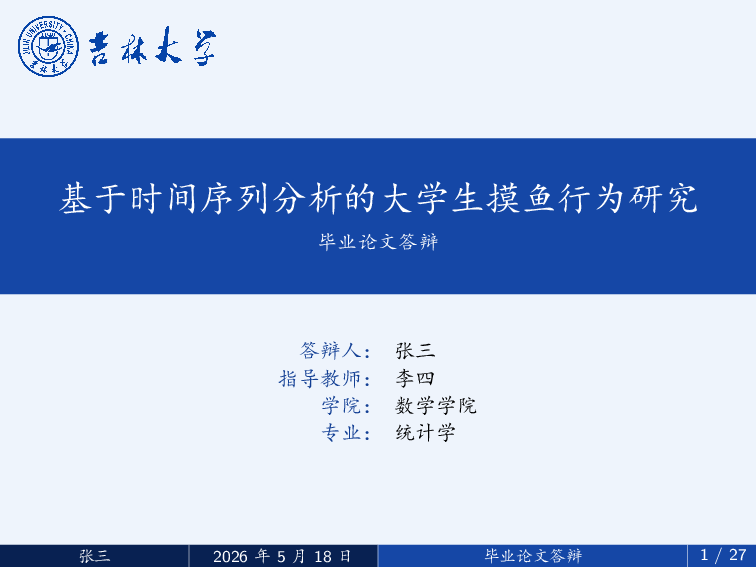
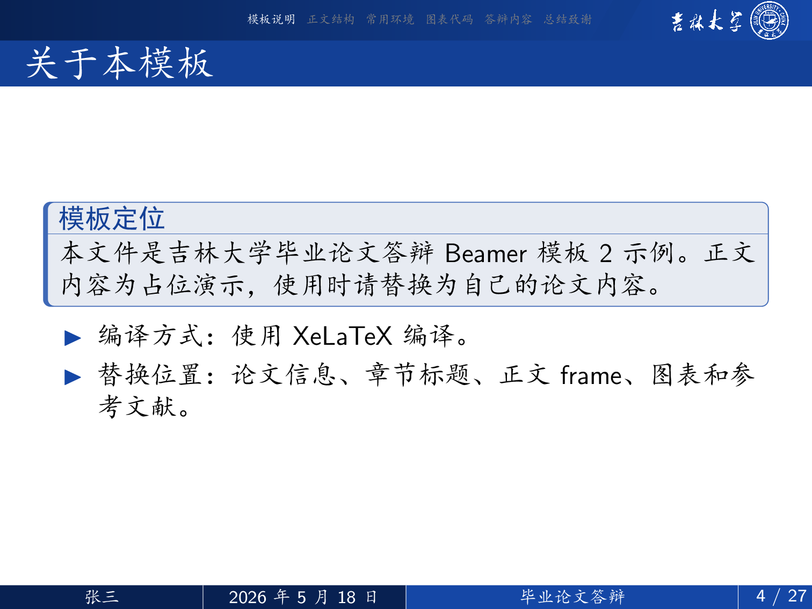
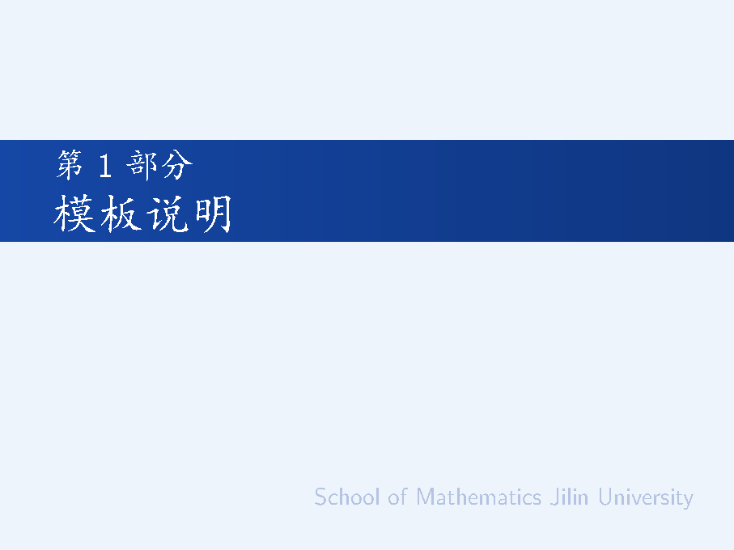

# 吉林大学 Beamer 答辩模板

[](https://opensource.org/licenses/MIT)
[](https://www.latex-project.org/)
[](https://tug.org/xetex/)

## 项目简介

本项目提供三套可独立下载、独立编译的吉林大学毕业论文答辩 Beamer 模板。模板已经内置中文字体、学校或学院标识和参考文献示例，适合直接作为答辩幻灯片的起点。

三套模板的示例内容、答辩信息字段和基础编译方式保持一致。使用者通常只需要选择一个模板目录，修改主 `.tex` 文件开头的论文信息，再替换正文页面中的占位内容。


## 模板清单

| 模板名称 | 目录 | 说明 |
| --- | --- | --- |
| 吉林大学模板1 | `jlu/` | 校名、校徽和校训组合的蓝白风格模板。 |
| 吉林大学模板2 | `jlu_v2/` | 传统居中封面与统一尾页的吉林大学模板。 |
| 吉林大学数学学院模板 | `math/` | 使用数学学院标识的学院答辩模板。 |

## 模板预览

| 模板 | 封面 | 内页 |
| --- | --- | --- |
| 吉林大学模板1 |  |  |
| 吉林大学模板2 |  |  |
| 吉林大学数学学院模板 |  |  |

## 格式与实现

三个模板均以单个 Beamer 主文件为入口，主要实现内容如下：

- 使用 `ctex`、`fontspec` 和 XeLaTeX 支持中文排版。
- 每个模板目录内置 `SimKai.TTF`、`SimHei.TTF`、`SimSun.TTC`，降低本地和 Overleaf 的字体差异。
- 使用 `tikz` 绘制封面、章节页、页眉、页脚和结束页。
- 使用 `booktabs` 提供三线表示例，使用 `listings` 提供代码展示示例。
- 使用 `natbib` 和 `gbt7714-numerical` 生成顺序编码制参考文献。
- 每个模板都保留 `images/` 目录，供使用者放置论文图表、实验结果和插图。

## 项目结构

请保持目录结构不变。每个模板都依赖本目录中的字体、素材和参考文献文件。

```text
jluthesis-beamer/
├── docs/
│   └── previews/                # README 使用的高清预览图
├── jlu/                         # 吉林大学模板1
│   ├── assets/                  # 校徽、校名、校训及派生 PNG 资源
│   ├── fonts/                   # 模板内置中文字体
│   ├── images/                  # 用户图片目录
│   ├── jlu_defense.tex          # 模板入口
│   ├── jlu_defense.pdf          # 编译预览 PDF
│   └── references.bib           # 参考文献数据库
├── jlu_v2/                      # 吉林大学模板2
│   ├── assets/                  # 校级视觉资源
│   ├── fonts/                   # 模板内置中文字体
│   ├── images/                  # 用户图片目录
│   ├── jlu_v2_defense.tex       # 模板入口
│   ├── jlu_v2_defense.pdf       # 编译预览 PDF
│   └── references.bib           # 参考文献数据库
├── math/                        # 吉林大学数学学院模板
│   ├── assets/                  # 数学学院标识及派生 PNG 资源
│   ├── fonts/                   # 模板内置中文字体
│   ├── images/                  # 用户图片目录
│   ├── math_defense.tex         # 模板入口
│   ├── math_defense.pdf         # 编译预览 PDF
│   └── references.bib           # 参考文献数据库
├── .gitignore
├── LICENSE
└── README.md
```

## 环境准备

推荐使用 TeX Live 或 MacTeX，并确认可以运行 `xelatex` 和 `bibtex`。

在线编辑平台建议优先使用 TeXPage。模板包含中文字体、Beamer、TikZ 图形和参考文献示例，在线平台需要多轮编译；Overleaf 在部分项目中可能出现编译超时，TeXPage 对中文 LaTeX 和国内网络环境通常更友好。

如果使用 Overleaf，请上传所选模板目录的完整压缩包，并在项目设置中将编译器改为 XeLaTeX。若遇到编译超时，建议改用 TeXPage 或本地 TeX Live / MacTeX 编译。

## 发布版本

每套模板维护独立的 release tag，便于按模板跟踪版本。发布页提供的是单套模板 ZIP 包，下载后进入对应模板目录即可使用。

| 模板名称 | 最新 tag | ZIP 下载 |
| --- | --- | --- |
| 吉林大学模板1 | [`jlu-template-v2026.05.07-6`](https://github.com/Jackknifer/jluthesis-beamer/releases/tag/jlu-template-v2026.05.07-6) | [下载 ZIP](https://github.com/Jackknifer/jluthesis-beamer/releases/download/jlu-template-v2026.05.07-6/jlu-template-v2026.05.07-6.zip) |
| 吉林大学模板2 | [`jlu-v2-template-v2026.05.07-6`](https://github.com/Jackknifer/jluthesis-beamer/releases/tag/jlu-v2-template-v2026.05.07-6) | [下载 ZIP](https://github.com/Jackknifer/jluthesis-beamer/releases/download/jlu-v2-template-v2026.05.07-6/jlu-v2-template-v2026.05.07-6.zip) |
| 吉林大学数学学院模板 | [`math-template-v2026.05.07-6`](https://github.com/Jackknifer/jluthesis-beamer/releases/tag/math-template-v2026.05.07-6) | [下载 ZIP](https://github.com/Jackknifer/jluthesis-beamer/releases/download/math-template-v2026.05.07-6/math-template-v2026.05.07-6.zip) |


## 字体与资源

模板默认从本目录的 `fonts/` 文件夹读取中文字体。建议保留这些字体文件，避免不同系统字体名称不一致导致编译失败。

吉林大学模板1和吉林大学模板2使用 `assets/` 中的校徽、校名和校训资源；吉林大学数学学院模板使用 `assets/` 中的数学学院标识资源。`images/` 目录留给使用者存放自己的图片，不建议删除。

## 常见问题

**中文乱码或显示方框**

请确认使用 XeLaTeX 编译，并保留对应模板目录下的 `fonts/` 文件夹。

**参考文献显示为 `[?]`**

请使用完整编译链：`xelatex -> bibtex -> xelatex -> xelatex`。

**提示找不到图片、字体或 `references.bib`**

请先进入模板目录再编译。

**Overleaf 编译失败**

请确认上传的是完整模板目录，并在 Overleaf 设置中选择 XeLaTeX。不要只上传单个 `.tex` 文件。若错误表现为编译超时，建议改用 TeXPage 或本地 TeX Live / MacTeX。

## 声明

本项目为非官方模板，未经过吉林大学或相关学院官方发布、授权或认证。正式使用前，请根据学校、学院、导师和答辩秘书的具体要求自行确认。

## 许可证

本项目采用 [MIT 许可证](LICENSE) 开源。
